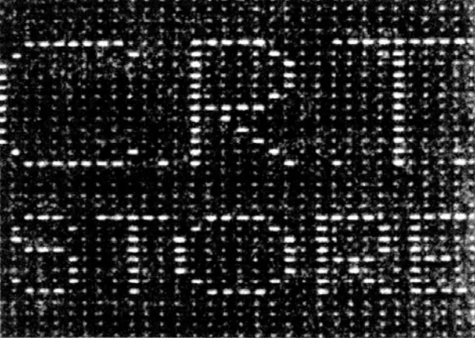
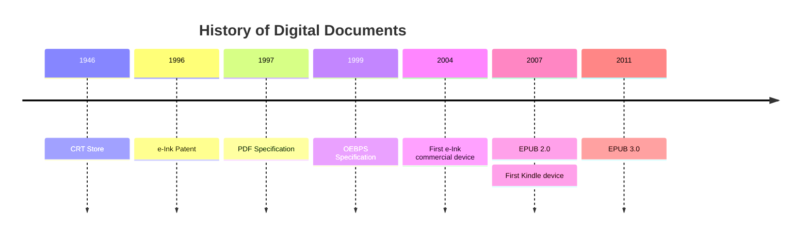
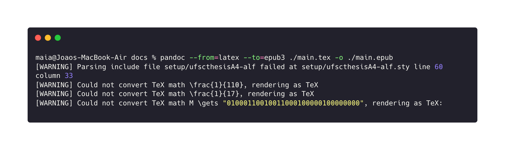

+++
title = 'Preparing LaTeX projects for EPUB publication'
date = 2025-12-20T21:19:20-03:00
draft = true
categories = ['Digital Publishing']
tags = ['LaTeX', 'EPUB', 'books']
+++

## Intro

Recently I was drawn to research more about digital publishing and digital formats as part of a collaboration with an independent publisher and my findings about the (probable) state of the art on conversion techniques may be of some use to other publishers or tech enthusiasts trying to share their work on more adaptative formats than an old PDF.

The initial goal of the project was to convert dozens of already published books to a digital format capable of being distributed on the most number of platforms as possible. Those books were stored as LaTeX projects on Overleaf but digital publication wasn't a priority at the time of editing and that reflects into the usage of commands and packages to support physical attributes of the document but a complete lack of precautions to help digital formats. Since the books are copyrighted, all the examples on this article will use my own graduation monography.

## Summary

After reading this you'll know:

<!-- TODO: create custom style for numbered lists -->
1. A little history about digital formats
2. How to convert a .tex project to a .epub file
3. How to fix common issues with pre-processing
4. How to enhance the .epub file for publishing

If you want to skip directly to action, start on [Document Conversion](./#document-conversion)

## Digital documents: from ink to e-ink

Digital documents were made part of most of our lives in the last two decades and are taken for granted by people. Bills, books and newspapers are just some examples of "digital things" for my generation that were very much "not digital things" to my mother's generation and the ones before hers. Before PDFs, the web and even ASCII, text was being stored and presented by Williams and Kilburn [1] on the first ever register of a digital text representation. It's a long stretch to call this a document: it doesn't have a specific format, it's stored directly on memory positions and it didn't fits the dictionary definition for document.



Even so, this weird pixelated message serves to evidentiate a critical point that will guide our discussion for the next moments. There's a fundamental difference between physical and digital in this context and that's how information is stored versus how it's represented to the reader. On physical documents the information is stored in exactly the same shape that it is viewed by the eyes, while for digital documents information is concealed on a quasi-magic black box that is then interpreted to us by a renderer so we can access it. Even the most plain .txt file in your computer is actually encoded to bytes that represents the actual characters you are trying to write. From this we can extract the important conclusion that digital documents have as it's two main components the source file and the rendered file.

Since computer scientists always enjoyed a finite but very long list of abstractions, we created markup languages to make possible to represent not only the text but formatting and style of our really important documents. This step empowered computers to take on new tasks and solve new problemas for humans but also created an annoying problem that took decades to solve.

Imagine that I now have the JML (João Markup Language) and that I created a renderer which represents `#--#` as a horizontal divider for documents that spans for 300 pixels (the width of my screen) and that works beautifully to me. To share my work with others I send a file on my new language to some colleagues and each one of them writes a renderer that treats `#--#` as a different number of pixels, following their own screens. My source file is the same, so you would think that the document is the same, but each reader is actually seeing something different and from their point of view these are several different documents.

People were furious, marching on the streets with torches and pitchforks demanding for a solution to this problem, they were all screaming for portable documents that could be shared between different computers and look the same. Adobe saw this and had the brilliant idea of actually creating a Portable Document Format, giving birth to PDF. First as a exclusively proprietary format, but after some years the specification entered the umbrella of ISO and then became one of the most used file formats of all time.

That should be the happy ending of our history, but times change and as the needs of the future diverge from the past, devices began to have different screen proportions, purposes and the web was established as humanity's new Eden with dynamic document rendering. All these ingredients contributed to the search for a standard that could manage to adapt itself for different device screens and the answer were already there in the web, literally. The first open standard for digital publications was released on 1999 and named OEBPS, based on XHTML and CSS organized by a manifest file with a predefined set of keys that would guide software into rendering common elements of digital publications.

All of this was happening at the same time that some MIT undergrads were trying to come up with a technology that could bring digital publications to a new era, a material capable of delivering the look & fell of paper while being reusable and electronic. The crafting of e-Ink elevated the potential of portable devices focused on digital documents with lower power usage, better visibility while outdoors and a comfortable prolonged reading experience, since this material doesn't emit light by itself. The first commercial use for e-Ink came in 2004 with Sony Librie but by 2010 it was already flooding the market with Kindles, Kobos and other devices and the flaws of the current formats were being exposed.

OEBPS didn't kept the rhythim of web standards and technologies, falling behind on new internationalization and styling practices that were being adopted on websites, like RTL and vertical writing systems. A loose package structure was also a problem with OEBPS, each editing tool could generate a different file or folder schema and this chaotic environment was a barrier for new adopters. All this issues we're part of the motivation for the development of a new standard and EPUB 2.0 (a direct successor from OEBPS 1.2) was published by the IDPF with changes like a defined format for metadata, a container package structure and updates to the allowed contents.

EPUB was updated a couple more times, the current version is EPUB 3.2, rising as the de-facto industry format for digital publications and even proprietary variations like AWZ3 are just wrappers for the open specification, adding features like DRM and vendor-specific protections. The whole ecosystem for publishers is built around EPUB, all modern e-readers support it, there are new features being discussed and will gradually be implemented.



## Document conversion

After understanding a bit more about different document types and the caracteristics they can carry it was clear to me why conversions are such a big problem: documents formats are languages on their own and as said by Umberto Eco, translation is the art of failure

There are constructs specifics to one language that will never be able to be transposed to another, like LaTeX custom commands or HTML `<iframe>` tags. There's also features that can be reimaginated like a Markdown link becoming an HTML `<a>` or an HTML table transformed into ASCII for a .txt file. Finally there's fully compatible elements like HTML and Markdown headings with multiple levels. Usually, the more complex an element is, harder is the process of translating it to a different language.

### Pandoc

Pandoc aims to be an universal digital document converter, it's open source, written in Haskell, released under the GPL license and created by professor John MacFarlane. The software works by converting the source file into an intermediate document representation and then transforming this into the target file format. This architecture makes it easier to implement new formats since it's not necessary to make all the formats talk to each other, just make them compatible with the intermediate format.

That strenght comes with some limitations, the most notable being that only features contained within the scope of this middle format are supported by Pandoc. As an example, if you try to convert a HTML document that uses some fancy CSS property like a gradient for background the result will be a blank background on the target format. That means that you'll probably never get a lossless conversion while using pandoc on real-world scenarions, but personally I think this cost is cheap compared to being able to convert between literally hundreds of combinations of formats.

Installing pandoc is as easy as running `brew install pandoc` on MacOS or following instructions on their [installation page](https://pandoc.org/installing.html) for your preferred platform.

### First conversion experiment

With pandoc installed, I've tried the most straight forward approach just converting the whole file parting from `main.text` with complete content. The command structure for pandoc is:

```bash
# pandoc --from={source} --to={target} source.extension -o target.extension
pandoc --from=latex --to=epub3 main.tex -o main.epub
```



Running this on my project raised some warnings that will serve to examplify issues on the LaTeX to EPUB pipeline. First of all, pandoc tries to force the conversion even if fails to identify some constructs on your source file, as seen on those warnings concerning TeX math functions and a .sty file. Despite those issues, a main.epub file was generated and contained a fair version of my source file and this is the time for a first revision.

The first caught issues were relared to custom commands that pandoc can't expand and are then stripped leaving you with just the text content. Some LaTeX blocks we're also compromised, like the following block that was rendered as `5.5cm Este trabalho é dedicado a todos que não chegaram aqui comigo.` without the width constraints. This happens because pandoc doesn't actually process the `adjustwidth` environment since it's not part of the lowest TeX primitives and comes from the `changepage` package. Pandoc then chooses to display the environment args as content, this behavior can be configured to render the full environment as text on the final format but another solution is available with some code. 

```latex
\begin{adjustwidth*}{}{5.5cm}     
    Este trabalho é dedicado a todos que não chegaram aqui comigo.
\end{adjustwidth*}
```

#### Pandoc filters

By writing filters on Pandoc we can customize the conversion process with our own logic and apply virtually any transformations needed to the target file on-the-fly using scripting languages. Pandoc ships with a Lua interpreter since 2.0, but you can also use another languages for filters by using an interpreter available on a system-wide context. I should also note that filters on other languages will have to operate on the JSON AST version of the document, while Lua filters receive a native object from Pandoc.

Below there's an example of how to extract content from a specific latex environment by using the AST generated by Pandoc to remove the first element of a `adjustwidth` environment. The proccess is quite boring and writing more comprehensible filters will be even harder to write, but this is a very powerful tool that can be reused for multiple projects and keep a common level of quality between them.

```lua
function Div(el)
  if el.classes[1] ~= "adjustwidth" and el.classes[1] ~= "adjustwidth*" then
    return el
  end
  
  para = el.content[1]

  if not para or para.t ~= "Para" then
    return el
  end

  if not para.content[1] or para.content[1].t ~= "Span" then
    return el
  end

  table.remove(para.content, 1)

  return el.content
end
```

#### Math support

Now let's address the math notation warnings that showed up on my first run. Pandoc actually has 3 alternatives for mathematical markup with different caveats that you should balance to your needs when picking a solution. The first and more modern approach is MathML, a markup language designed specifically for this needs that will render beautiful and crisp notation which blends well even for inline math, but has a lack of suport on older devices like earlier generations of Kindles.

Then we have two alternatives that transforms your equations into images and embed then on your text, providing perfect support for older devices but as the cost of resolution, accessibility and alignment. Webtex converts your equations with online APIs, while Gladtex uses local tools and can generate SVGs to minimize the resolution loss. During my tests it was really frustrating to see how much better MathML is and knowing I'll probably can't use it for the next couple of years, but at least the support is being gradually improved

> To use any of the three options all you need to do is append on of this options on the CLI: `--mathml`, `--webtex` or `--gladtex`.

### Post processing

While writing filters can be a smart idea for conversion problems that happen often, sometimes an issue is so rare that a custom filter for it isn't worth it and you have to resort to manual proofreading. That's when an EPUB editor comes in handy, allowing you to directly edit the HTML code to adjust small details or fix anything that you couldn't do in the pre-processing steps.

[Sigil](https://sigil-ebook.com/sigil/) is a free and open source EPUB editor that runs on Mac, Linux or Windows and delivers a very solid experience for light editing. It has weakness like the lack of a collaborative environment and a not so good text editor (if you're used to more powerful editors like vscode)

// Sigil installation
// Pre processing
// Post processing
// Final results

[1] - https://medium.com/@aareed/the-first-digital-text-on-a-screen-7c391432dbdd

[2] - https://www.w3.org/community/epub3/

[3] - https://parsio.io/blog/a-brief-history-of-pdf/